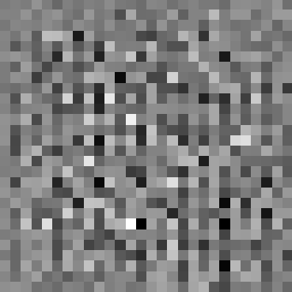
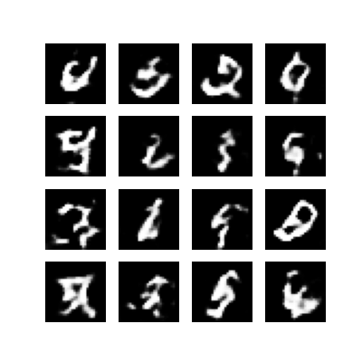
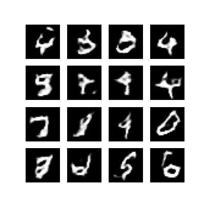
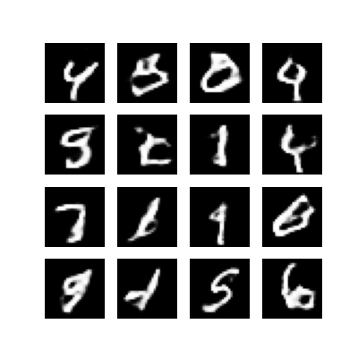
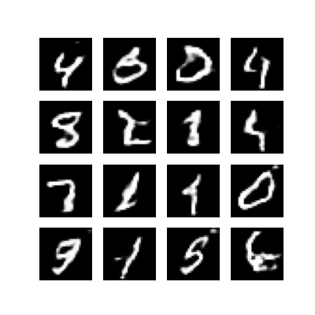
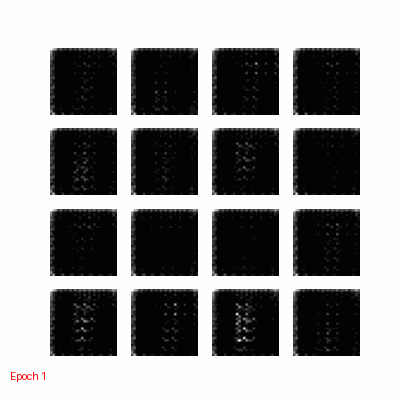

# GAN for MNIST Handwritten Digits

## 📌 Project Overview
This project implements a **Generative Adversarial Network (GAN)** from scratch in **Keras & TensorFlow** to generate realistic handwritten digits similar to the MNIST dataset.

A GAN consists of two neural networks trained together:
- **Generator**: Learns to create synthetic digit images from random noise.
- **Discriminator**: Learns to distinguish between real MNIST images and fake images created by the generator.

Both models compete, and over time the generator produces increasingly realistic digits.

---

## ⚙️ Features
- Custom-built Generator and Discriminator networks using TensorFlow/Keras.
- Training loop with `tf.GradientTape`.
- Model checkpointing to resume or reuse training.
- Visualization of generated digits per epoch.
- Creation of a **GIF animation** showing generator progress.
- Export of all generated images (epochs 1–100) into a single **ZIP archive**.

---

## 🚀 Getting Started

### 1. Install Dependencies
Make sure you have Python 3.8+ and install required libraries:

```bash
pip install tensorflow matplotlib pillow tensorflow-docs
```

### 2. Run the Notebook
Launch Jupyter Notebook or Colab:

```bash
jupyter notebook GAN_MNIST_Notebook.ipynb
```

### 3. Training
Training runs for **50 epochs by default**. You can adjust the number of epochs:

```python
EPOCHS = 100
```

### 4. Outputs
- Images are saved as `image_at_epoch_XXXX.png` (e.g., `image_at_epoch_0001.png`).
- A GIF animation is created (`dcgan_animation.gif`).
- A concatenated PNG of all results (`dcgan_animation.png`).
- A ZIP archive containing all generated images (`dcgan_images.zip`).

---

## 📊 Results (Generated Fake Images)

**Input Image**


**Progression of Generated Digits**
- Epoch 1  
  

- Epoch 25  
  

- Epoch 50  
  

- Epoch 75  
  

- Epoch 100  
  


### Example (Generated Digits Progress)


---

### Real MNIST images:


## 📈 Possible Improvements
- Implement **FID (Fréchet Inception Distance)** or **Inception Score** for evaluation.
- Explore **deeper architectures** for generator and discriminator.
- Extend GAN training to **color image datasets** (e.g., CIFAR-10).
- Try **Conditional GANs (cGANs)** to generate specific digits.


